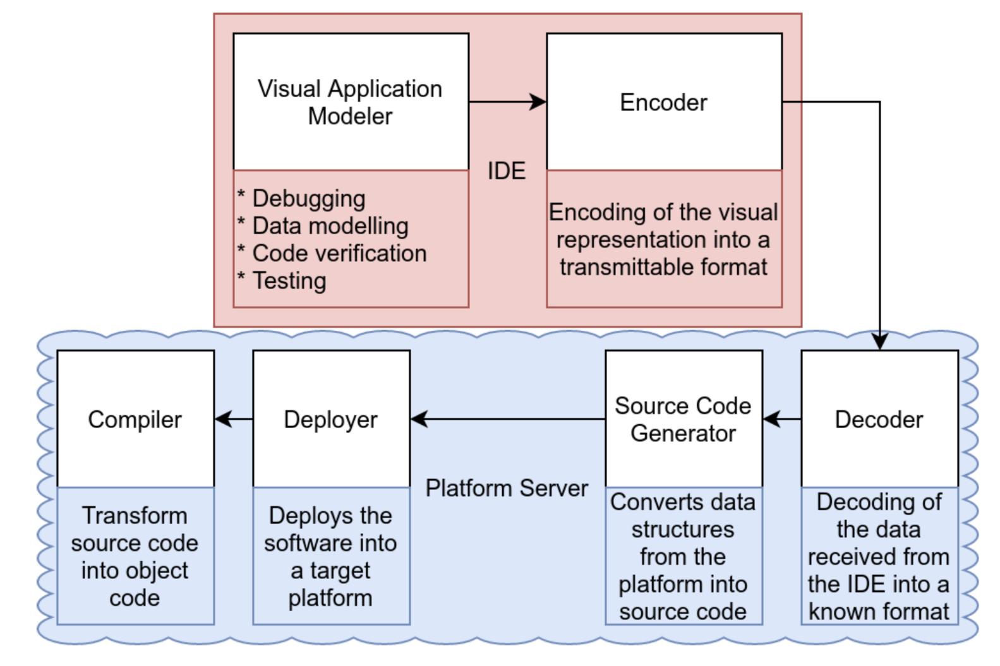
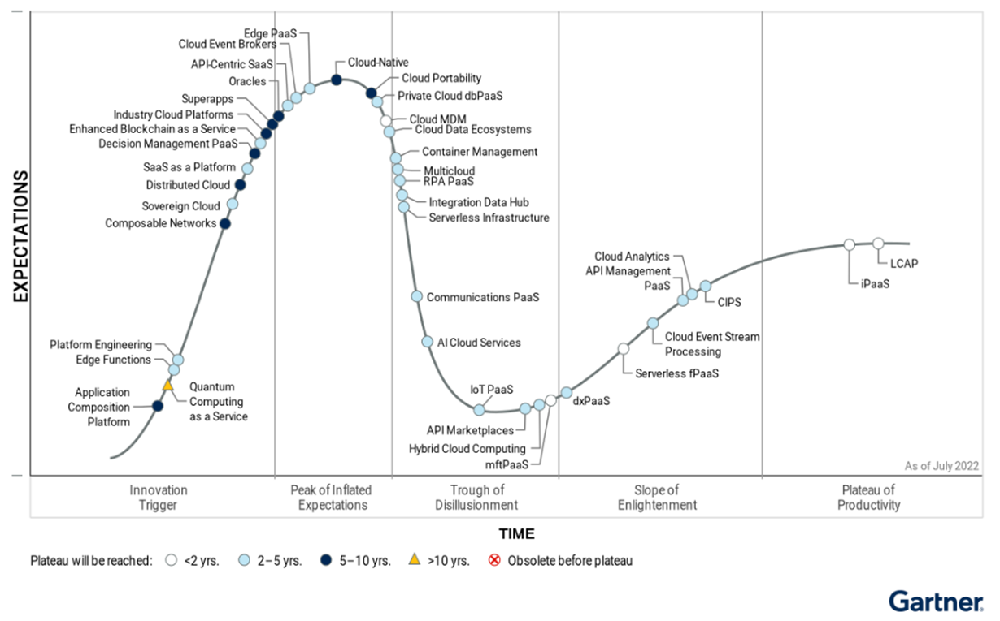

= Low-Code Ansatz zur Anwendungsprogrammierung
Elisabeth Lorenz, Erik Semmler, Galiia Shaekhova, Luisa Schnebelt 
:toc:
:toc-title: Gliederung

== Motivation

Statistik der unbesetzten stellen von It-Kräften in deutschland. Die Anzahl steigt stetig. Es wird erkennbar, dass im jahr 2019 die zahl enorm Anstieg, dies hat hauptsächlich die Coronapandemie zu Schulden.

Hintergedanke von Low-Code: Menschen mit wenige Programmierkenntnisse können Anwendungen entwickeln.
Boilerplatecode → Abnahmen von trivialen aufgaben, dinge die man immer machen musst
Missverständnisse bei den Anforderungen 
Wartungskosten

Ergebnis Metaanalyse von 2020: Verhältnis von Softwarewartungs- und Entwicklungskosten, Mittelwerte aus einschlägigen wissenschaftlichen Arbeiten
Reduktion ermöglicht durch:
???
Softwareentwicklern werden “triviale” Aufgaben abgenommen
dadurch entsteht mehr Zeit für Aufgaben wie Problemlösung oder Algorithmenentwicklung (wofür Devs ja ausgebildet werden)
Boilerplate Code wird für templates mit generiert, Benutzeroberfläche kann 
It- Kräfte an Mangel 

== Generationen von Programmiersprachen

Low Code lässt sich in den Generationen der Programmiersprachen in die 4. Generation, die Deklarative Programmierung einordnen. 
Programmierparadigmen: ist der stil in dem eine Programmiersprache entworfen wurde

1GL:
Maschinensprache: Wie der Name bereits erläutert, gab es in der ersten Generation eine Sprache, die nur Computer verstehen konnten. Dies kann durch den Prozessors eines Computers gelesen werden und besteht aus binären und digitalen Sprachen. 
Beispiel: 

2Gl:
Assemblersprache: Der Assembler übersetzt den Assembler Programmcode/ Quellcode in ein Maschinenprogramm. Assembler Code ist für den Menschen lesbar. Erschien erstmals im Jahr 1948
Nachteile Schlechte Lesbarkeirt und wartbarkeit, ist an einem Prozesor gebunden 
Beispiel Sprache: Fortran
→ dabei Anwendungen wurden immer Komplexer, es war sehr Zeitaufwendig. Entwickler brauchten mehr Zeit, es scheiterten viele Projekte. Budget wurd gesprengt

1960er erste Softwarekrise → neue sprechen wurden eingeführt
3GL:
Prozedurale Programmierung: Die Prozedurale Programmierung ist ein Paradigma der imperativen Programmiersprache. Es definiert eine Sequentieller/ Strukturierten Ablauf von Befehlen. Wiederverwendbare Teile werden in Funktionen ausgelagert, diese müssen vom Programmierer verstanden werden.  Sie besteht aus folgen anweisungen und verschiedenen Kontrollstrukturen ( schleifen, if-bedingungen, etc….).  → Strukturierte Programierung 
in den 1970 mit der Programiersprache pascal
1970 ebenfalls objektorientierte programmiersprach
Objektorientierter Ansatz wurde 1990 in den meidsten programmiersprachen eingeführt 

→ nichte mehr prozessor abhängig

4GL. 
Ziel der Sprache höheres Abstraktniveu
Was bedeutet Abstraktion:
Vereinfachung, Kernproblem bleibt vorhanden→ auf des wesentliche konzentrieren

Nochmal mit zeitangaben Programmiersprachen
■ 1950er- bis 1960er-Jahre: 
Programmiersprache ist Assemblersprach 
Ablauf wird durch ein Flussdiagramm dargestellte

■ 
1970er-Jahre: 
Strukturierende, Dominierende programmiersprachen 
beispiel Pascal
strukturierendedarstellungstechniken werden angewendet, wie strukturierendes design
software prozesse orientieren sich am wasserfallmodell 

■ Ab 1990er-Jahre: 
Objektorientiertprogrammiersprachen werden immer belieber C++, java
Vereinheilichender prozess durch Unified Modeling Language (UML), 
orientiert sich am spiralmodell (UML)

== Model Dricen Development (MDD)

1990: AT&T-Fernverkehrsnetz im Nordosten brach zusammen 
Grund: fehlende Break Anweisung 
kleine kodierungsfehler unerwartete folgen 
Problem von Softwareentwickler und Designer entwicklung von Software ist sehr kommplex
kann diese Komplexität eingegrenzt werden durch mdd? 
Wenn wir zum Beispiel versuchen einen Wolkenkratzer ohne den Einsatz von modernenWerkzeuge wie Bulldozer und hydraulische Hebevorrichtungen zu bauen, ist zwar theoretisch machbar, aber wahrscheinlich eine sehr komplexe Aufgabe sein. Die einzig mögliche Lösung für den der zunehmenden Komplexität ist die Minimierung des Grad der zufälligen Komplexität zu minimieren.

MDD

Modelle sind zum Beispiel auch in Ingenieurwesen sehr wichtig. 
Enginere benutzen zum beispiel mathematische model um die tragfähigkeit zu analysieren 
Problem: 
Modelle werden von Hand in Code geschrieben, daher gibt es keine formale Verbindung zwischen modell und Programmcode 
Schwierig modell zu pflegen, ist mit viel aufwand verbunden und implementierungen aktuelle zu halten ist schwierig. 
Deswegen sind modelle ungenau, oft auch aufgrund von Zeitdruck 
Dokumentation deswegen nicht vertrauenswürdig

Unterschied modellbasiert und Modellgetrieben: modellbasiert wird modellerstellt und code per hand geschrieben. Dient zur Dokumentation 
Modellgetrieben nach erstellunge des modelles wird automatisch code generiert. 
Geschichte von MDD
Hohe Softwarekosten auswirkungen für Unternehmen, aber noch schlimmer ist ein schlechtes softwaredesign, das die produktivität beeinflusst
Statistiken besagen, dass ca. 70% der Software-Projekte Budget und Termin überschreiten → anhaltenden Software-Krise.

Geschichte hier nochmal rausschreben → was ist OMG
http://eddi.informatik.uni-bremen.de/SUSE/pdfs/Diplomarbeit_Radek_Eckert.pdf

andere Quellen 
Formale Modelle werden Automatisiert und lauffähiger Code wird generiert, in code übersetzt→ in lauffähige software übersetzt 
Formale Modelle besitzen eindeutige Syntax und Semantik, Beispiel hierfür ist UML (Besispeil Tool, Enterprise Architekture
anstelle der dokumentation wird durch modellierung programmcode erstellt

https://swa.informatik.uni-hamburg.de/files/abschlussarbeiten/Diplomarbeit%20Michael%20Wilk%20final.pdf

Automatisiert den Entwicklungsprozess
ziel: Kosten senken, schwierigkeitsgrad reduzieren, Qualität verbessern 
Prozess generiert das fertige Endprodukt
Im gegensatz zu gewöhnlichen softwareentwicklungsprozessen, geht es nicht um dokumentation und analyse sondern um die entwicklung entwicklungsansatz)
Normalerweise werden Modelle als Dokumentation benutzt
Entwickler haben kein wissen über den 	Quellcode

== Low Code

Low-Code ermöglicht es Personen ohne großen Programmierkenntnissen eine Anwendung zu erstellen. Somit sind Unternehmen nicht auf IT-Spezialisten angewiesen. Zum einen kann die IT-Abteilung entlastet werden und zum anderen können die Anwendungsanforderungen spezifischer gestaltet werden, da Experten des Themengebiet die Anforderungen am besten kennen. 

Mithilfe von Low-Code können mit einer Drag- und Drop-Funktion Eingabe-, Navigation-, Dropdown-Felder und Steuerelemente hinzugefügt werden. Es können verschiedene Bildschirmansichten erstellt werden, diese werden mit Hilfe von  Steuerelementen miteinander verknüpft. 

Programmierung läuft über eine grafische Benutzeroberfläche.
Entwicklungsumgebung mit der code erstellt wird
Es wird über eine grafische oberfläche code projeziert
forster research hat den begriff ins leben gerufen 

Geeignet für sogenannte Citizen Developers: 
können Programme entwickeln, können aber keine genaue Programmiersprache. Kennen sich im Bereich aus. In der Programmierung verlassen sie sich auf das Tool. Nutzer sind auch Entwicklung. 

=== Ziele von Low Code

Einbeziehen von CItizen Developers in Modellierung von Geschäftsabläufen, da Sie schon damit vertraut sind
Low-Code ermöglicht es Personen ohne großen Programmierkenntnissen eine Anwendung zu erstellen. Somit sind Unternehmen nicht auf IT-Spezialisten angewiesen. Zum einen kann die IT-Abteilung entlastet werden und zum anderen können die Anwendungsanforderungen spezifischer gestaltet werden, da Experten des Themengebiet die Anforderungen am besten kennen. 

Mithilfe von Low-Code können mit einer Drag- und Drop-Funktion Eingabe-, Navigation-, Dropdown-Felder und Steuerelemente hinzugefügt werden. Es können verschiedene Bildschirmansichten erstellt werden, diese werden mit Hilfe von  Steuerelementen miteinander verknüpft. 

Programmierung läuft über eine grafische Benutzeroberfläche.
Entwicklungsumgebung mit der code erstellt wird
Es wird über eine grafische oberfläche code projeziert
forster research hat den begriff ins leben gerufen 

Geeignet für sogenannte Citizen Developers: 
können Programme entwickeln, können aber keine genaue Programmiersprache. Kennen sich im Bereich aus. In der Programmierung verlassen sie sich auf das Tool. Nutzer sind auch Entwicklung.  von Wartungskosten in Softwareentwicklung
siehe: https://dl.gi.de/handle/20.500.12116/37795
leicht zusammengestellt werden
Schnelligkeit: 5- 10 mal schneller als traditionelle programmierung
Kosteneinsparung:
Weniger Komplex: Fokus liegt darauf software individuell anzupassen und Benutzeranforderungen zu erfüllen 
Einfache wartungsarbeiten: → wenig code anbieten wenig code muss gewartet werden. 
Wenig technische Anforderungen erforderlich. Dadurch Abteilungsleiter die sich mit dem technischen nicht auskennen aber dafür viel fachliches wissen haben. könne beser anforderunge spezifizieren 

=== Architektur von Low Code

Alle Low Code Plattformen sind ähnlich aufgebaut. Hierbei gibt es eine Teilung in zwei verschiedene Teile: IDE, welches die integrierte Entwicklungsumgebung beschreibt und dem Platform Server, welche das Backend der Plattform ist.
Im IDE befindet sich zum einen der Vision Application Modeler. In diesem werden alle Funktionalitäten vom Nutzer entwickelt und implementiert. Dazu gehört die Codeerstellung, welche grafisch oder mit Text angefertigt werden kann, das Debugging und das Testen. Zum anderen befindet sich im IDE der Encoder. Dieser exportiert das visuelle Anwendungsmodell in ein neues Format, ohne das Funktionen verloren gehen. 
Der Decoder, welcher sich im Platform Server befindet, interpretiert dann die codierten Daten und gibt sie an den Source Code Generator weiter. Hier wird der Code dann in Quellcode umgewandelt, wobei man die Entscheidung treffen kann, in welche Sprache es geniert werden soll. Der Deployer stellt das Projekt in der gewünschten Plattform bereit und im Compiler wird der Code dann übersetzt. (https://www.researchgate.net/publication/354862325_OLP-A_RESTful_Open_Low-Code_Platform/fulltext/6151c756f8c9c51a8af9f640/OLP-A-RESTful-Open-Low-Code-Platform.pdf?origin=publication_detail)

== Vergleich von Low Code und traditioneller Programmierung an Anwendungsbeispiel

=== Vorstellung Anwendungsbeispiel

Wir haben als Beispiel beschlossen, eine Anwendung zu entwickeln, die den Prozess der Meldung eines Unfalls, der den versicherten Gegenständen eines Nutzers zugestoßen ist, vereinfacht.
Mit dieser App kann man: 
das versicherte Objekt des Benutzers auswählen,
einen der vier Vorfälle auswählen und die Einzelheiten des Vorfalls eintragen,
Nach Eintragung der wichtigsten Angaben können Bilder des Schadens hochgeladen werden.
Anschließend können weitere Details des Unfalls genannt werden. 
Zum Schluss erhält der Nutzer eine Übersicht und kann die Reklamierung absenden.

=== verwendete Werkzeuge

Im Vergleich zur traditionellen Programmierung ermöglicht es Low-Code eine Anwendung ohne große Programmierkenntnisse, mittels einer grafischen Oberfläche zu entwickeln. 
Der Code wird automatisch erzeugt. 
Um diese Aussage zu testen, haben wir zwei Webanwendungen mit der Programmiersprache JavaScript und der Low-Code-Plattform Mendix entwickelt. 

==== ReactJS etc.

Für die JavaScript-Entwicklung wurden die Bibliotheken React und React-Bootstrap gewählt, um die Benutzeroberfläche zu erstellen. React ermöglicht es, eine interaktive Benutzeroberfläche zu erstellen, und React-Bootstrap bietet eine einfache Anpassung der Stile, ohne dass große CSS-Dateien erstellt werden müssen. Für das Backend wurden Node.js und eine MySQL-Datenbank verwendet.

==== Mendix

=== Vergleich

==== GUI

GUI steht für "Graphical User Interface" und bezieht sich auf die Art und Weise, wie ein Computerprogramm oder ein Betriebssystem dargestellt wird. Es nutzt Bilder und Symbole anstelle von Textbefehlen, um dem Benutzer die Interaktion mit dem Computer zu erleichtern.

TP
Bei der Entwicklung in JavaScript gibt es keine grafische Benutzeroberfläche. Alle einzelnen Komponenten und Styles werden zunächst blind hinzugefügt, ohne zu wissen, wie die endgültige Benutzeroberfläche aussehen wird. Beim Start der Anwendung kann der Entwickler das Layout der einzelnen Komponenten im Code oder zunächst im Entwicklertool einrichten und dann alles in seinen Code übernehmen.

Low Code

Die grafische Oberfläche einer Low Code Plattform ist das einzige und wichtigste Tool für den Nutzer. Hier kann über ein Drag & Drop Baukasten grafisch „programmiert“ werden, wobei die Frontend-Elemente mit Workflows verknüpft werden können. Workflows beschreiben hierbei die Anwendungslogik. Die Nutzung von vorgefertigten Code-Elementen vereinfachen das Bauen von diversen Anwendungen, jedoch ist das Hinzufügen von eigenem Code auch über die GUI möglich.
(https://www.mendix.com/de/ein-leitfaden-zur-app-entwicklung-mit-low-code/#merkmale-und-vorteile-von-lowcode)

==== Anwendungslogik
Damit meinen wir, wie die Anwendung auf die Aktionen des Benutzers reagiert, d. h. was passiert, wenn der Benutzer auf die eine oder andere Taste klickt, was passiert, wenn der Benutzer die ausgefüllten Daten abschickt.

TP
Die Anwendungslogik  einer Anwendung beschreibt die konkrete Verknüpfung von Bausteinen zu einer Anwendung. Sie schreibt also die Aufrufreihenfolge der einzelnen Bausteine sowie die Parameterübergabe innerhalb der Anwendung vor.
При программирование на JavaScript разработчик получая требования продумывает полностью  Event Listeners

Low Code 

Die Anwendungslogik basiert bei Low Code Plattformen auf Workflows, Microflows und Datenmodellen. Es ist möglich, seine Anwendung so mit einfachen Abläufen zusammenzustellen, wobei man auch hier die Möglichkeit hat, auf vorgefertigte Flows und Datenmodelle zuzugreifen. (https://docs.mendix.com/studio/workflows/, https://docs.mendix.com/studio/microflows/, https://docs.mendix.com/studio/work-with-data/)

==== Qualitätskontrolle

Low Code 

Bei Mendix ist die Qualitätssicherung dadurch gegeben, dass alle plattforminternen Elemente vorgetestet sind. Das bedeutet, dass alle Komponenten ohne zusätzliche Tests ausgeführt werden können. Zusätzlich dazu laufen im Hintergrund für den Nutzer nicht ersichtlich, Test. Hier wird dann ausgegeben und auf der GUI direkt gekennzeichnet, wo und was der Fehler ist. 
Das Anbinden von externen Testsystemen wie Selenium oder JUnit, wird von Mendix unterstützt. (https://www.mendix.com/blog/three-tools-to-test-your-mendix-application/)

==== Wiederverwendbarkeit

При программирование одинаковые куски кода компонуются в отдельные компоненты или функции, которые используются в дальнейшем в том же проекте. Для удобства данные функции/компоненты могут быть собраны в отдельную библиотеку, что позволит легко внедрить в другие проекты.

Low Code

Die Wiederverwendbarkeit bei Low Code Plattformen ist durch das Nutzen von vorgefertigten Elementen grundsätzlich gegeben. Die Speicherung und dadurch auch die Wiederverwendung von eigenen Segmenten ist je nach Plattform möglich. So kann die eigene Bibliothek kontinuierlich erweitert werden und ermöglicht auch anderen Nutzer des Teams auf diese zugreifen zu können.
Ein Nachteil hierbei ist, dass die Wiederverwendbarkeit nur plattformintern gegeben ist. (https://www.mendix.com/de/ein-leitfaden-zur-app-entwicklung-mit-low-code/#merkmale-und-vorteile-von-lowcode)

==== Zeitaufwand

Wie aus der. Grafik erkennbar ist, war der Zeitaufwand um einiges kürzer. Hierbei ist jedoch die Verteilung der Zeiten komplett anders als bei der traditionellen Programmierung. Die erste Einarbeitung und Kennenlernen der Plattform ist zeitaufwendig. Wenn man es aber mit der Erlernen einer neuen Programmiersprache vergleichen würde, ist der Zeitaufwand jedoch relativ gering. Das Aufsetzen eines neuen Projektes funktioniert hier über einen Klick voraus gesetzt man möchte ein neues leeres Projekt aufsetzten, da die Auswahl einer Vorlage wahrscheinlich ein bisschen mehr Zeit in Anspruch nehmen würde. Die Entwicklungszeit ist bei Low Code direkt abhängig von dem Verhältnis selbst geschriebenen und vorgefertigten Codes.

=== Literaturvergleich

Zur Erweiterung der im vorangegangenen Abschnitt dargestellten Ergebnisse wurde nach vergleichbaren Experimenten in der wissenschaftlichen Literatur gesucht. Dabei fiel das Experiment von Calçada und Bernardino [QUELLE] auf, dessen Ergebnisse in Abbildung [ABBNR] zu sehen sind. Dieses Experiment befasste sich mit der Programmierung von zwei simplen Anwendungen in verschiedenen Entwicklungsumgebungen und dem Vergleich verschiedener Metriken bezüglich der Entwicklung. Es wurden je ein einfacher Taschenrechner sowie ein Texteditor entwickelt. Bei den verwendeten Umgebungen handelte es sich um Java Swing, die Low-Code Umgebung Neptune9 und JavaScript.

Zusätzlich zu der von uns betrachteten Entwicklungszeit wurden in diesem Experiment die Anzahl an selbst geschriebenen Codezeilen, die Zeiten zum Laden der graphischen Oberfläche sowie die Zeiten zum Ausführen verschiedener anwendungsspezifischer Operationen erfasst. Die genauen Anforderungen und untersuchten Operationen sind in [QUELLE] aufgelistet. In Abbildung [ABBNR] sind jeweils die durchschnittlichen Werte zwischen den beiden Anwendungen erfasst. Beim Vergleich dieser Ergebnisse mit den von uns gesammelten Daten ergibt sich zunächst eine Ähnlichkeit bezüglich der Entwicklungszeiten. In beiden Versuchen liegt bei der Low-Code Anwendung die niedrigste Entwicklungszeit vor, wobei der Unterschied zwischen Low-Code und JavaScript im Experiment von Calçada und Bernardino wesentlich geringer ist als in unserem Beispiel.

.Bildunterschrift, [QUELLE]
image::literature_comparison_table.png[]

Zudem ist die hohe Diskrepanz zwischen den beim Aufbauen der GUI ermittelten Zeiten bemerkenswert, da diese auf einen eventuellen Tradeoff von Performance zugunsten von Entwicklungszeit bei der Low-Code Entwicklung hinweist. Allerdings ist hierbei sowohl auf die geringe Stichprobenmenge als auch auf die fehlenden Vergleiche zwischen verschiedenen Low-Code Plattformen hinzuweisen, weshalb diese Ergebnisse nicht belastbar sind, um allgemeine  Schlussfolgerungen zu Low-Code zu ziehen.

Vergleiche dieser Art sind in der Literatur allerdings selten, da sie zum einen abhängig von den Vorkenntnissen der jeweils beteiligten Entwickler unterschiedlich ausfallen. Zum anderen sind diese Experimente zeitaufwendig und geben auf Grund der schwer definierbaren Rahmenbedingungen nur wenig objektive Rückschlüsse auf die verwendeten Technologien.

Quelle: Calçada, André, and Jorge Bernardino. “Experimental Evaluation of Low Code Development, Java Swing and JavaScript Programming.” International	Database Engineered Applications Symposium, September 22, 2022. https://doi.org/10.1145/3548785.3548792.

=== Grenzen von Low Code

Es ist nicht möglich, klare Grenzen von Low Code zu definieren. Die Grenzen beschreiben hier bei eher den Aufwand und Nutzen.
Die Nutzung von Low Code Plattformen eignet sich vor allem für nicht innovative Anwendungen, wie zum Beispiel Zugriff auf verschiedene APIs oder das Einrichten einer simplen Website. Neue Funktionen müssen immer mit eigenen Code unterstützt werden, somit muss man zu Beginn des Projektes eine Einschätzung treffen, ob man mit Low Code schneller sein würde, weil man zum Teil vorgefertigte Komponenten nutzen kann oder ob es sinnvoller ist, ein traditionelles Programm aufzusetzen.
Außerdem sind bei jeder Plattform die Grenzen verschieden, da oftmals Low Code Plattformen auf verschiedene Funktionalitäten spezialisiert sind. Deswegen ist die Wahl des richtigen Systems umso wichtiger, da ein Wechsel auf eine andere Plattform oftmals nicht möglich ist, weil man an die Plattform gebunden ist. (https://www.mendix.com/de/ein-leitfaden-zur-app-entwicklung-mit-low-code/#eine-lowcodeplattform-auswählen)

== Fazit

Einfache Anwendung 
Schnelle Auf- und Umsetzung von Projekten
Praktisch für nicht innovative Funktionen
Für komplexe Anwendungen eher ungeeignet
Große Abhängigkeit von Tools

== Ausblick

Abschließend wollen wir einen Ausblick zur zukünftigen Entwicklung von Low-Code Entwicklungsplattformen geben. Hierzu wenden wir uns an den im August 2022 veröffentlichten Cloud Platform Technology Hype-Cycle der IT-Beratungsfirma Gartner [QUELLE]. Dabei handelt es sich um eine Visualisierung der Erwartungen von potentiellen Nutzern und Medien bezüglich einer Technologie in den frühen Phasen ihres Bestehens. Wie in Abbildung [ABBNR] sichtbar ist, befinden sich Low-Code Entwicklungsplattformen, verzeichnet als LCAP (Low-Code Application Platforms), am Ende des Hype Cycles. 

.Bildunterschrift, [QUELLE1]

Diese Positionierung bedeutet, dass Low-Code Entwicklungsplattformen nach Einschätzung von Gartner, in weniger als 2 Jahren, also spätestens im Sommer 2024, das Plateau der Produktivität erreichen. Technologien, welche diese Phase in ihrer Entwicklung erreicht haben, sind laut Gartner [QUELLE2] praxiserprobt genug, um vom Mainstream adoptiert zu werden. Zudem sind Kriterien zur Auswahl von unterschiedlichen Anbietern klar definiert [Quelle2]. 

Quelle1: https://www.gartner.com/en/newsroom/press-releases/2022-08-04-cloud-platform-hc-press-release
Quelle2: https://www.gartner.com/en/research/methodologies/gartner-hype-cycle

== Literaturverzeichnis
