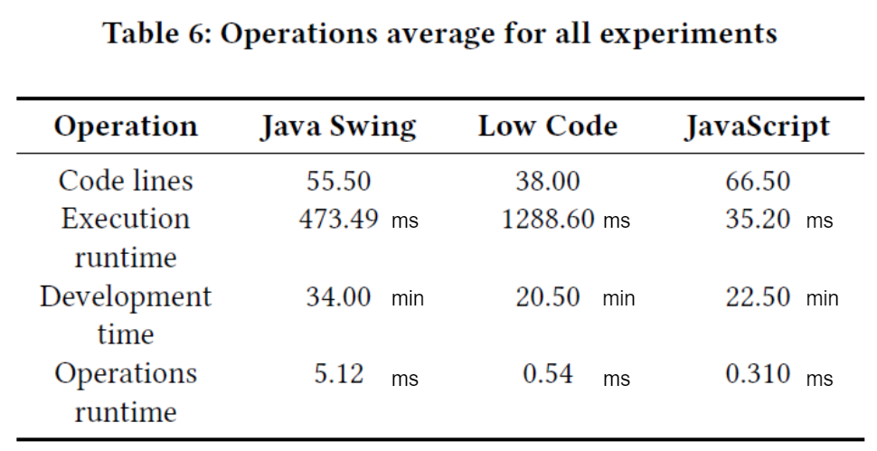

= Low-Code Ansatz zur Anwendungsprogrammierung
Elisabeth Lorenz, Erik Semmler, Galiia Shaekhova, Luisa Schnebelt, HTWK Leipzig (WS22/23 MIM Modul Software Engineering, Prof. Andreas Both)
:toc:
:toc-title: Gliederung
:imagesdir: img/

== Einleitung

In der Softwareentwicklung wird ständig nach alternativen Entwicklungsansätzen und Prozessen gesucht, welche dabei helfen sollen, das Arbeiten effizienter und erfolgreicher gestalten. Ein Grund dafür ist die Anzahl von nicht vollständig erfolgreich abgeschlossenen IT-Projekten. Dem Chaos Report der Standish Group aus dem Jahr 2015 zufolge haben "52% der IT-Vorhaben [...] zumindest teilweise nicht die Wünsche und Anforderungen der Auftraggeber erfüllt. 19% der Projekte sind ein Totalausfall und wurden abgebrochen. Nur 29% der untersuchten Projekte waren total erfolgreich." <<1>> Diese Ergebnisse sind das Resultat von vielen unterschiedlichen Faktoren, welche bei der Softwareentwicklung eine Rolle spielen. Durch Untersuchungen wie diese wird deutlich, dass die in der Softwareentwicklung eingesetzten Prozesse noch Verbesserungsbedarf aufweisen. 

Es ist im Rahmen dieser Arbeit nicht möglich, auf die Vielzahl von Faktoren, welche den Ausgang eines Softwareprojekts beeinflussen können, einzugehen. Dementsprechend werden im Weiteren nur ausgewählte Faktoren betrachtet. Im Verlauf dieser Arbeit wird auf die folgenden Problempunkte der Softwareentwicklung sowie die zugehörigen, von Low-Code Entwicklungsplattformen verfolgten, Lösungsansätze eingegangen:

* geringe Einbeziehung der Nutzer in den Entwicklungsprozess

Dies führt potentiell zu ungenauer Anforderungsspezifikation, beziehungsweise sich im Laufe des Projekts ändernden Anforderungen oder zu geringer Ressourcenallokation auf Grund von unterschätztem Arbeitsaufwand.

* hoher Arbeitsaufwand für Entwickler

* hohe Wartungskosten für Software

Auf Grund der hohen Komplexität von Anwendungen ist Wartung aufwändig und erfordert geschultes Personal, wodurch der Ressourcenaufwand für die Softwarewartung steigt. Die Kosten für Softwarewartung bewegen sich seit den 1970er Jahren, wie von Lehner <<2>> gezeigt, zwischen 50% und 90% anteilig zu den Entwicklungskosten. Eine Reduktion der Wartungskosten für Software würde also erhebliche Ressourcen freisetzen. 

== Die Entwicklung von Programmiersprachen und Einordnung von Low Code
Die Entwicklung von Programmiersprachen begann im 19. Jahrhundert. Sie lässt sich in 5 Generationen einteilen. Es begann mit der ersten Generation der Maschinensprachen. Diese Sprachen waren prozessorspezifisch und nur für Maschinen lesbar. Hierbei wurde ein binärer Programmcode an den Prozessor gesendet. Im Jahr 1948 wurde erstmals von Assemblersprachen gesprochen und ersetzte in Kürze die Maschinensprache. Im Gegensatz zu dieser ist die Assemblersprache auch für den Menschen lesbar. Hierbei wird der Code durch einen Assembler in Maschinensprache übersetzt. In den 1960er gab es einen großen Sprung in der Programmierentwicklung. Programmcode war nicht mehr Hardware beziehungsweise Software abhängig. Aufgrund dessen wird oft von höheren Programmiersprachen gesprochen. Dazu gehören zum Beispiel prozedurale Sprachen, wie zum Beispiel die in den 1970er entwickelte Programmiersprache Pascal. Ebenfalls in den 1970er entstand die objektorientierte Programmierung. Der objektorientierte Ansatz wurde in den 1990er in den meisten Programmiersprachen durchgesetzt. Ein Beispiel für eine objektorientierte Programmiersprache ist Java. In der darauffolgenden 4. Generation können keine exakten Programmiersprachen zugeordnet werden. Dazu gehören alle Sprachen, die einen höheren Abstraktionsgrad erzeugen als in der 3. Generation. <<3>> <<4>>
Abstraktion bedeutet die Beschränkung bzw. Konzentration auf das Wesentliche. <<5>> Die Erhöhung des Abstraktionsgrades ist auch ein Ziel des Entwicklungsansatzes Modell Driven Development und gehört somit zur 4. Generation der Programmiersprachen. Dieser Ansatz wird im darauffolgenden Abschnitt genauer beschrieben. 

== Model Driven Development – MDD
Modelle dienen dazu, Teile einer Software zu repräsentierten. Sie sind nützlich zur Planung und Dokumentation eines Programms. Sie abstrahieren Teile eines Systems. Die Entwicklung einer Software ist sehr komplex, daher bedeutet Abstraktion hierbei, dass der Fokus auf den wesentlichen Teilen eines Systems liegt. Der komplexe Teil wird außen vorgelassen. 
Durch die Modellierung einer Software entsteht zum einen ein besseres Verständnis für Auftraggeber, da der Ablauf eines Systems durch ein Modell einfacher zu verstehen ist als der Quellcode eines Programms. Die Anforderungen einer Software können besser verstanden werden und somit die Missverständnisse zwischen Entwickler und Auftraggeber verringern. 
Es können Designprobleme besser erkannt werden, denn wenn diese erst nach der Entwicklung erkannt werden, können hohe Kosten entstehen.<<6>>
Aus einer Umfrage von Großunternehmen weltweit resultierte, dass 70 % der befragten Unternehmen bereits das Scheitern eines Projektes erlebt haben. Grund hierbei waren Anforderungen, die bei der Planung des Projektes nicht bekannt waren. <<7>>

Daraus resultiert, dass Modelle einen wichtigen Bestandteil zur Entwicklung von Softwaresystemen beitragen. Dabei gibt es Unterschiede zwischen modellbasierter- und modellgetriebener Softwareentwicklung. Modellbasiert bedeutet, das Modell wird erstellt und darauf basierend wird anschließende der Code geschrieben.<<8>> Code und Modell sind somit unabhängig voneinander. Wird eine Änderung im Code vorgenommen, wird dies nicht zeitgleich im Modell übernommen. <<9>>

In der modellgetriebenen Softwareentwicklung hingegen wird ermöglicht, aus einem Modell einen lauffähigen Code zu generieren. Ein Kriterium hierbei ist es, dass es sich um ein formales Modell handelt. Formale Modelle besitzen eine eindeutige Syntax und Semantik. <<10>>

.Ablauf von Modellgetriebener Softwareentwicklung, https://wiki.eclipse.org/images/8/8d/Using_MDD_Eclipse_Technology_to_implement_SOA.pdf
image::Modell_Driven_Development.png[] 

Durch die automatische Generierung von Quellcode kann Entwicklungszeit eingespart werden und somit auch Kosten. Des Weiteren ist die Abstraktion höher. Durch gute Dokumentation ist es einfacher Fehler zu finden. In der modellbasierten Entwicklung war dies nicht möglich, da durch ständige Änderungen des Quellcodes das Modell oft nicht aktualisiert wurde.<<11>>
Ein erster Ansatz der modellgetriebenen Entwicklung startete in den 1990er mit Computer Aided Software Engineering (Case). Die war ein Ansatz um aus Modellen, Quellcode zu erzeugen. Dieser Ansatz war allerdings nicht ausgearbeitet. Zum Beispiel waren Case-Werkzeuge Hersteller abhängig. Case setzt sich in der modellgetriebenen Softwareentwicklung nicht durch. <<9>>
In den 1990er der wurde der objektorientierte Ansatz in den meisten Sprachen durchgesetzt. Der Fokus musste nun auf die Entwicklung von objektorientierten Werkzeugen liegen, dadurch entstand der bis heute verwendete Modellierungssprache „UML“ (Udenifind Modelling Language). Durch Tools wurde es ermöglicht, zeitgleich Modell und Code zu ändern. <<8>>

== Low Code
Low Code ist auch eine modellgetriebene Softwareentwicklung. Die Erstellung eines Programms läuft über eine grafische Benutzeroberfläche. Es können per Drag-and-drop Steuerungselemente wie Buttons oder Inputfelder hinzugefügt werden. Die Verknüpfung von Elementen funktioniert über Workflows des Weiteren können Datentabellen in Form von Datenmodellen erstellt und in einer Cloud abgespeichert werden. Der Quellcode wird automatisch im Hintergrund generiert. Es können Desktop- als auch Mobilanwendungen schnell entwickelt werden.

Low-Code ermöglicht es Personen ohne großen Programmierkenntnissen eine Anwendung zu erstellen. Somit sind Unternehmen nicht auf IT-Spezialisten angewiesen. Zum einen kann die IT-Abteilung entlastet werden und zum anderen können die Anwendungsanforderungen spezifischer gestaltet werden, da Experten des Themengebiet und somit die Anforderungen am besten kennen. 
<<12>>

=== Ziele von Low Code:
Das Ziel von Low-Code ist es, zum einem über einen kurzen Zeitraum Anwendungen zu entwickeln, dadurch können auch Kosten gespart werden. Zum anderen sind wenig technische Anforderungen erforderlich und kaum Programmierkenntnisse nötig. Die Einarbeitungszeit ist wesentliche geringer als das Beibringen von Programmiersprachen. 
Dadurch können zum Beispiel Abteilungsleiter, die sich mit Programmieren kaum oder überhaupt nicht auskennen, Anwendungen erstellen. Ein Vorteil ist, sie besitzen viel fachliches Wissen und können dadurch besser Anforderungen spezifizieren. 
<<13>>

=== Architektur von Low Code

Alle Low Code Plattformen sind ähnlich aufgebaut. Hierbei gibt es eine Teilung in zwei verschiedene Teile: IDE, welches die integrierte Entwicklungsumgebung beschreibt und dem Platform Server, welche das Backend der Plattform ist.
Im IDE befindet sich zum einen der Vision Application Modeler. In diesem werden alle Funktionalitäten vom Nutzer entwickelt und implementiert. Dazu gehört die Codeerstellung, welche grafisch oder mit Text angefertigt werden kann, das Debugging und das Testen. Zum anderen befindet sich im IDE der Encoder. Dieser exportiert das visuelle Anwendungsmodell in ein neues Format, ohne das Funktionen verloren gehen. 
Der Decoder, welcher sich im Platform Server befindet, interpretiert dann die codierten Daten und gibt sie an den Source Code Generator weiter. Hier wird der Code dann in Quellcode umgewandelt, wobei man die Entscheidung treffen kann, in welche Sprache es geniert werden soll. Der Deployer stellt das Projekt in der gewünschten Plattform bereit und im Compiler wird der Code dann übersetzt. <<14>>

.Architecture von Low-code
image::httpswww.researchgate.netpublication354862325_OLP-A_RESTful_Open_Low-Code_Platformfulltext6151c756f8c9c51a8af9f640OLP-A-.png[]

== Vergleich von Low Code und traditioneller Programmierung an Anwendungsbeispiel
Im Vergleich zur traditionellen Programmierung ermöglicht es Low-Code eine Anwendung ohne große Programmierkenntnisse, mittels einer grafischen Oberfläche zu entwickeln. 
Der Code wird automatisch erzeugt. 
Um diese Aussage zu testen, haben wir zwei Webanwendungen mit der Programmiersprache JavaScript und der Low-Code-Plattform Mendix entwickelt.

=== Vorstellung Anwendungsbeispiel

Als Beispiel wurde beschlossen, eine App zu entwickeln, die den Prozess der Meldung eines Unfalls, der dem versicherten Fahrzeug eines Nutzers zugestoßen ist, vereinfacht.
Mit dieser App kann man: 

*   ein versichertes Fahrzeug des Nutzers auswählen
*   einen der vier Vorfälle (Unfall, Brand, Diebstahl, Sonstiges) auswählen und die Einzelheiten des Vorfalls eintragen
*   die Bilder des Schadens hochladen
*   weitere Details des Unfalls ausfühllen
*   zum Schluss eine Übersicht erhalten und die Reklamierung absenden

Das untenstehende Aktivitätsdiagramm stellt das Verhalten der Anwendung dar, wenn die Option "Unfall" gewählt wird. Jede Farbe des Rechtecks steht für eine Seite. Je nach der vom Benutzer gegebenen Antwort hängt es davon ab, welches zusätzliche Feld oder welche Seite für den Benutzer zum Ausfüllen sichtbar sein wird.  

.Aktivitätsdiagramm der "Unfall"-Option
image::unfall_diagramm.png[]

=== Verwendete Werkzeuge
Für die Erstellung dieser Anwendungen wurden verschiedene Tools verwendet.

==== ReactJS etc.

Für die JavaScript-Entwicklung wurden die Bibliotheken React und React-Bootstrap gewählt, um die Benutzeroberfläche zu erstellen. React ermöglicht es, eine interaktive Benutzeroberfläche zu erstellen, und React-Bootstrap bietet eine einfache Anpassung der Stile, ohne dass große CSS-Dateien erstellt werden müssen. Für das Backend wurden Node.js und eine MySQL-Datenbank verwendet.

==== Mendix
Mendix ist  eine vielseitige Softwareentwicklungsplattform, die es ermöglicht, mobile und Webanwendungen in großem Umfang zu erstellen, einzusetzen, zu warten und zu verbessern. [...]
<<15>>

Warum wurde Mendix gewählt?

Weil Mendix ein Marktführer in seinem Bereich ist. Das IT-Beratungsunternehmen Gartner veröffentlichte im August 2022 einen Bericht zur Marktforschung über Low-Code-Unternehmensanwendungsplattformen (Enterprise Low-Code Application Platforms - LCAP) [...]. Sie verwenden den Magic Quadrant, der Markttrends wie Richtung, Reifegrad und Teilnehmer aufzeigt.
<<16>>

.Magic Quadrant for Enterprise Low-Code Application Platforms
image::magic_Quadrant.png[,500 ]

Horizontal (Completeness of Vision) wird die Vollständigkeit der Vision dargestellt. Das heißt, sie spiegelt die Innovationskraft des Anbieters wider und zeigt, ob der Anbieter den Markt steuert oder ihm folgt [...].
<<17>>

Die Vertikale (Ability to execute) zeigt die Fähigkeit zur Ausführung. Er fasst Faktoren wie die finanzielle Rentabilität des Anbieters, seine Reaktionsfähigkeit auf dem Markt, die Produktentwicklung, die Vertriebskanäle und den Kundenstamm zusammen [...].
<<17>>

Darüber hinaus ist der Magic Quadrant in vier Kategorien unterteilt. Er zeigt die Position der unterschielichen Low-Code Anbietern im Markt:
<<17>>

- *Führungskräfte* (Leaders) setzen ihre aktuelle Vision gut um und sind für morgen gut aufgestellt.
- *Visionäre* (Visionaries) verstehen, wohin der Markt geht, oder haben eine Vision für die Veränderung der Marktregeln, setzen sie aber noch nicht gut um.
- *Nischenplayer* (Niche Players) konzentrieren sich erfolgreich auf ein kleines Segment oder sind unfokussiert und übertreffen andere nicht.
- *Herausforderer* (Challengers) führen heute gut aus oder dominieren vielleicht ein großes Segment, zeigen aber kein Verständnis für die Marktrichtung.

Der Magic Quadrant zeigt, dass Mendix die obere rechte Position, d.h. die führende Position, besetzt.

=== Vergleich
Auf Grund der entwickelten Beispiele wird der Vergleich in 4 Punkten erfolgen:

- GUI
- Anwendungslogik
- Qualitätskontrolle
- Wiederverwendbarkeit

==== GUI

GUI steht für "Graphical User Interface" und bezieht sich auf die Art und Weise, wie ein Computerprogramm oder ein Betriebssystem dargestellt wird. 
<<18>>

_Traditionelle Programmierung_ 

Bei der Entwicklung in JavaScript gibt es keine grafische Benutzeroberfläche. Alle einzelnen Komponenten und Styles werden zunächst blind hinzugefügt, ohne zu wissen, wie die endgültige Benutzeroberfläche aussehen wird. Beim Start der Anwendung kann der Entwickler das Layout der einzelnen Komponenten im Code oder zunächst im Entwicklertool einrichten und dann alles in seinen Code übernehmen. Das heißt, der Entwickler muss mindestens drei Fenster verwenden (den Browser, das Entwicklertool im Browser und die Entwicklungsumgebung), um Änderungen vorzunehmen und auftretende Fehler zu sehen.

_Low Code_

Die grafische Oberfläche einer Low Code Plattform ist das einzige und wichtigste Tool für den Nutzer. Hier kann über ein Drag & Drop Baukasten grafisch „programmiert“ werden, wobei die Frontend-Elemente mit Workflows verknüpft werden können. Workflows beschreiben hierbei die Anwendungslogik. Die Nutzung von vorgefertigten Code-Elementen vereinfachen das Bauen von diversen Anwendungen, jedoch ist das Hinzufügen von eigenem Code auch über die GUI möglich.
<<19>>

==== Logik
Damit meinen wir, wie die Anwendung auf die Events des Benutzers reagiert, d. h. was passiert, wenn der Benutzer auf die eine oder andere Taste klickt, was passiert, wenn der Benutzer die ausgefüllten Daten abschickt.

_Traditionelle Programmierung_ 

Zunächst entscheidet der Entwickler über die Architektur der Anwendung. Und je nach Architektur ist es möglich, über zusätzlichen Entwicklungsaufwand zu sprechen. In unserem Beispiel wurde eine Client-Server-Architektur verwendet.

Wenn es um die Logik zwischen den Komponenten geht, dann ist für jeden Event eine eigene Funktion zu erstellen, die das Verhalten der Komponente definiert. Neben der Entwicklung muss der Entwickler auch Clean Code schreiben, d.h. der Programmcode muss optimiert und für andere Entwickler leicht verständlich gemacht werden.

_Low Code_ 

Die Anwendungslogik basiert bei Low Code Plattformen auf Workflows, Microflows und Datenmodellen. Es ist möglich, seine Anwendung so mit einfachen Abläufen zusammenzustellen, wobei man auch hier die Möglichkeit hat, auf vorgefertigte Flows und Datenmodelle zuzugreifen. <<20>> <<21>> <<22>>

==== Qualitätssicherung/Qualitätskontrolle

Die Qualität der Software ist ein wichtiger Bestandteil für den Kunden. Der Kunde hat ein großes Interesse daran, dass sein Produkt störungsfrei läuft und seinen Anforderungen entspricht. 

Softwaretests ermöglichen einen gewissen Einblick in die Softwarequalität. Softwaretests ermöglichen einen Einblick in die Softwarequalität. Alle dokumentierten und entwickelten Tests geben dem Kunden einen klaren Hinweis darauf, ob die Software die Anforderungen erfüllt, welchen Belastungen sie standhält, welcher Prozentsatz des Codes von den Tests abgedeckt wird usw.

_Traditionelle Programmierung_ 

Bei der traditionellen Programmierung können Tests manuell durchgeführt oder automatisierte Tests entwickelt werden. 

Es gibt viele verschiedene Arten von automatisierten Tests. Welches Konzept, d.h. welche Art von Tests angewendet wird, hängt von der Art der Software ab. Das heißt, Testen auf verschiedenen Ebenen, von Unit-Tests bis zu End2End- und Akzeptanztest.

Die Entwicklung automatisierter Tests ist sehr zeitaufwändig. In der Praxis besteht die meiste Entwicklung immer zu 50 Prozent aus Entwicklungszeit und zu 50 Prozent aus der Entwicklung automatisierter Tests.

_Low Code_ 

Bei Mendix ist die Qualitätssicherung dadurch gegeben, dass alle plattforminternen Elemente vorgetestet sind. Das bedeutet, dass alle Komponenten ohne zusätzliche Tests ausgeführt werden können. Zusätzlich dazu laufen im Hintergrund für den Nutzer nicht ersichtlich, Test. Hier wird dann ausgegeben und auf der GUI direkt gekennzeichnet, wo und was der Fehler ist. 
Das Anbinden von externen Testsystemen wie Selenium oder JUnit, wird von Mendix unterstützt. <<23>>
==== Wiederverwendbarkeit

Wiederverwendbarkeit, d. h. die Wiederverwendung von Komponenten oder Codeteilen. Dies ist eine sehr beliebte Methode in der Entwicklung: Software, Webservices, Design, usw. Durch die Systematisierung der Wiederverwendung von Komponenten werden viele Kosten und Entwicklungszeiten gesenkt und in vielen Fällen wird die Qualität der Softwareprodukte verbessert. [...] <<24>>

_Traditionelle Programmierung_ 

Bei der Entwicklung mit React kann man einzelne UI-Komponenten erstellen, die später im Projekt verwendet werden, oder sie können einfach in ein anderes Projekt kopiert werden. Man kann sie auch leicht nach Bedarf ändern. Eine weitere Möglichkeit, entwickelte Funktionen und Komponenten zu verwenden, besteht darin, eine eigene Bibliothek dieser Komponenten zu erstellen. Diese Bibliothek kann in andere Projekte importiert werden. 

_Low Code_

Die Wiederverwendbarkeit bei Low Code Plattformen ist durch das Nutzen von vorgefertigten Elementen grundsätzlich gegeben. Die Speicherung und dadurch auch die Wiederverwendung von eigenen Segmenten ist je nach Plattform möglich. So kann die eigene Bibliothek kontinuierlich erweitert werden und ermöglicht auch anderen Nutzer des Teams auf diese zugreifen zu können.
Ein Nachteil hierbei ist, dass die Wiederverwendbarkeit nur plattformintern gegeben ist. <<25>>

==== Zeitaufwand

Das Interessanteste an diesem Vergleich ist die Entwicklungszeit. Wie der Begriff "Low Code" schon sagt, verkürzt er die Entwicklungszeit.

Die nachstehende Tabelle zeigt, wie viel Zeit für die Entwicklung aufgewendet wurde. Die Low-Code-Anwendung wurde von einer Person entwickelt, die React-Anwendung wurde in einem Team von drei Personen entwickelt.

[width="100%",options="header", cols="^,^,^"]
|===
|_Konventionell (ReactJS)_ |Aufgabenteil |_Low Code (Mendix)_
|1 h |Einarbeitung |10 h
|3,5 h |Aufsetzen des Projekts |0 h
|40 h |Entwicklungszeit |15h
|44,5 h |*Gesamt* |25 h
|===

_Traditionelle Programmierung_

Die Einarbeitung dauerte nicht lange, da jedes Teammitglied sowohl Erfahrung in der JavaScript-Entwicklung als auch in ReactJS hatte. Das Team musste lediglich sein Wissen auffrischen. Hätte das Team jedoch nicht bereits Kenntnisse in diesem Bereich, hätte es sehr viel Zeit zum Lernen gebraucht. 

Die Aufsetzung des Projekts dauerte etwa 3,5 Stunden. Wir mussten bestimmte Bibliotheken installieren, eine Verbindung zum Git-Repository herstellen, eine Verbindung zur Datenbank herstellen und so weiter.

Die Entwicklung hat am meisten Zeit in Anspruch genommen. Dies ist jedoch nicht der endgültige Zeitaufwand, da einige kleine Dinge nicht fertiggestellt wurden.

_Low Code_

Wie aus der Tabelle erkennbar ist, war der Zeitaufwand um einiges kürzer. Hierbei ist jedoch die Verteilung der Zeiten komplett anders als bei der traditionellen Programmierung. Die erste Einarbeitung und Kennenlernen der Plattform ist zeitaufwendig. Wenn man es aber mit der Erlernen einer neuen Programmiersprache vergleichen würde, ist der Zeitaufwand jedoch relativ gering. Das Aufsetzen eines neuen Projektes funktioniert hier über einen Klick voraus gesetzt man möchte ein neues leeres Projekt aufsetzten, da die Auswahl einer Vorlage wahrscheinlich ein bisschen mehr Zeit in Anspruch nehmen würde. Die Entwicklungszeit ist bei Low Code direkt abhängig von dem Verhältnis selbst geschriebenen und vorgefertigten Codes.

=== Literaturvergleich

Zur Erweiterung der im vorangegangenen Abschnitt dargestellten Ergebnisse wurde nach vergleichbaren Experimenten in der wissenschaftlichen Literatur gesucht. Dabei fiel das Experiment von Calçada und Bernardino [QUELLE] auf, dessen Ergebnisse in Abbildung [ABBNR] zu sehen sind. Dieses Experiment befasste sich mit der Programmierung von zwei simplen Anwendungen in verschiedenen Entwicklungsumgebungen und dem Vergleich verschiedener Metriken bezüglich der Entwicklung. Es wurden je ein einfacher Taschenrechner sowie ein Texteditor entwickelt. Bei den verwendeten Umgebungen handelte es sich um Java Swing, die Low-Code Umgebung Neptune9 und JavaScript.

Zusätzlich zu der von uns betrachteten Entwicklungszeit wurden in diesem Experiment die Anzahl an selbst geschriebenen Codezeilen, die Zeiten zum Laden der graphischen Oberfläche sowie die Zeiten zum Ausführen verschiedener anwendungsspezifischer Operationen erfasst. Die genauen Anforderungen und untersuchten Operationen sind in [QUELLE] aufgelistet. In Abbildung [ABBNR] sind jeweils die durchschnittlichen Werte zwischen den beiden Anwendungen erfasst. Beim Vergleich dieser Ergebnisse mit den von uns gesammelten Daten ergibt sich zunächst eine Ähnlichkeit bezüglich der Entwicklungszeiten. In beiden Versuchen liegt bei der Low-Code Anwendung die niedrigste Entwicklungszeit vor, wobei der Unterschied zwischen Low-Code und JavaScript im Experiment von Calçada und Bernardino wesentlich geringer ist als in unserem Beispiel.

.Bildunterschrift, [QUELLE]

Zudem ist die hohe Diskrepanz zwischen den beim Aufbauen der GUI ermittelten Zeiten bemerkenswert, da diese auf einen eventuellen Tradeoff von Performance zugunsten von Entwicklungszeit bei der Low-Code Entwicklung hinweist. Allerdings ist hierbei sowohl auf die geringe Stichprobenmenge als auch auf die fehlenden Vergleiche zwischen verschiedenen Low-Code Plattformen hinzuweisen, weshalb diese Ergebnisse nicht belastbar sind, um allgemeine  Schlussfolgerungen zu Low-Code zu ziehen.

Vergleiche dieser Art sind in der Literatur allerdings selten, da sie zum einen abhängig von den Vorkenntnissen der jeweils beteiligten Entwickler unterschiedlich ausfallen. Zum anderen sind diese Experimente zeitaufwendig und geben auf Grund der schwer definierbaren Rahmenbedingungen nur wenig objektive Rückschlüsse auf die verwendeten Technologien.

Quelle: Calçada, André, and Jorge Bernardino. “Experimental Evaluation of Low Code Development, Java Swing and JavaScript Programming.” International	Database Engineered Applications Symposium, September 22, 2022. https://doi.org/10.1145/3548785.3548792.

=== Grenzen von Low Code

Es ist nicht möglich, klare Grenzen von Low Code zu definieren. Die Grenzen beschreiben hier bei eher den Aufwand und Nutzen.
Die Nutzung von Low Code Plattformen eignet sich vor allem für nicht innovative Anwendungen, wie zum Beispiel Zugriff auf verschiedene APIs oder das Einrichten einer simplen Website. Neue Funktionen müssen immer mit eigenen Code unterstützt werden, somit muss man zu Beginn des Projektes eine Einschätzung treffen, ob man mit Low Code schneller sein würde, weil man zum Teil vorgefertigte Komponenten nutzen kann oder ob es sinnvoller ist, ein traditionelles Programm aufzusetzen.
Außerdem sind bei jeder Plattform die Grenzen verschieden, da oftmals Low Code Plattformen auf verschiedene Funktionalitäten spezialisiert sind. Deswegen ist die Wahl des richtigen Systems umso wichtiger, da ein Wechsel auf eine andere Plattform oftmals nicht möglich ist, weil man an die Plattform gebunden ist. (https://www.mendix.com/de/ein-leitfaden-zur-app-entwicklung-mit-low-code/#eine-lowcodeplattform-auswählen)

== Fazit
Low Code erleichtert die Entwicklung erheblich. Innerhalb von Sekunden ist möglich mit einem Knopfdruck eine Anwendung zu erstellen, hierbei ist es egal, ob für Desktop oder Mobile Anwendungen. Während bei traditioneller Entwicklung für unterschiedliche Betriebssysteme unterschiedliche Programmiersprachen oder Frameworks benutzt werden müssen. Hierbei müssen zum Beispiel erst einmal Liberias installiert werden. Anwendungen können mit wenig Programmierkenntnisse erstellt werden, somit sind Unternehmen nicht mehr von Programmierer abhängig, die selten Kapazität besitzen. 
Jedoch kommt auch Low-Code in einem gewissen Punkt an seine Grenzen. Individuelle Anwendungen, die innovative Funktionen beinhalten sind mit Low-Code eher schwer umsetzbar, da der komplette Quellcode nicht ersichtlich ist. Desweitern sind anwender an ein Tool gebunden und muss sich an ihre Konditionen halten.
Abschließend lässt sich sagen, Low Code ist eine gute Überlegung für Unternehmen, um schnell und einfach Softwareprojekte umzusetzen. Jedoch kommt es immer darauf an, wie zeitintensiv, kostspielig und innovativ die Anwendung werden soll, um zu bestimmen ob sich Low Code lohnt oder die Traditionelle Programmierung eine bessere Lösung ist.

== Ausblick

Abschließend wollen wir einen Ausblick zur zukünftigen Entwicklung von Low-Code Entwicklungsplattformen geben. Hierzu wenden wir uns an den im August 2022 veröffentlichten Cloud Platform Technology Hype-Cycle der IT-Beratungsfirma Gartner [QUELLE]. Dabei handelt es sich um eine Visualisierung der Erwartungen von potentiellen Nutzern und Medien bezüglich einer Technologie in den frühen Phasen ihres Bestehens. Wie in Abbildung [ABBNR] sichtbar ist, befinden sich Low-Code Entwicklungsplattformen, verzeichnet als LCAP (Low-Code Application Platforms), am Ende des Hype Cycles. 

.Bildunterschrift, [QUELLE1]

Diese Positionierung bedeutet, dass Low-Code Entwicklungsplattformen nach Einschätzung von Gartner, in weniger als 2 Jahren, also spätestens im Sommer 2024, das Plateau der Produktivität erreichen. Technologien, welche diese Phase in ihrer Entwicklung erreicht haben, sind laut Gartner [QUELLE2] praxiserprobt genug, um vom Mainstream adoptiert zu werden. Zudem sind Kriterien zur Auswahl von unterschiedlichen Anbietern klar definiert [Quelle2]. 

Quelle1: https://www.gartner.com/en/newsroom/press-releases/2022-08-04-cloud-platform-hc-press-release
Quelle2: https://www.gartner.com/en/research/methodologies/gartner-hype-cycle

[bibloigraphy]
== Literaturverzeichnis

* [1] Chaos Report 2015, Standish Group - https://www.standishgroup.com/sample_research_files/CHAOSReport2015-Final.pdf
* [2] Lehner, F., (2021). Die Softwarewartungskosten als Managementproblem im Wandel der Zeit – Ergebnisse einer Metaanalyse. In: Helferich, A., Henzel, R., Herzwurm, G. & Mikusz, M. (Hrsg.), Software Management 2021. Bonn: Gesellschaft für Informatik e.V.. (S. 73-89). DOI: 10.18420/swm2021-006
* [3] https://medien.umbreitkatalog.de/pdfzentrale/978/344/640/Leseprobe_l_9783446405585.pdf
* [4]https://www.edv-buchversand.de/productinfo.php?replace=false&cnt=productinfo&mode=2&type=2&id=dp-524&index=2&nr=0&window=edvbv&art=Leseprobe&preload=false
* [5] https://www.itwissen.info/Abstraktion-abstraction-OOP.html
* [6] Model-Driven Software Development,Stephen W. Liddle
* [7] https://www.pressebox.de/pressemitteilung/alfabet-ag/Studie-belegt-In-70-der-Unternehmen-scheitern-IT-Projekte-wegen-unterschiedlicher-Planungssichten/boxid/596894
* [8] http://eddi.informatik.uni-bremen.de/SUSE/pdfs/Diplomarbeit_Radek_Eckert.pdf
* [9] https://swa.informatik.uni-hamburg.de/files/abschlussarbeiten/Diplomarbeit%20Michael%20Wilk%20final.pdf
* [10] https://silo.tips/download/seminararbeit-modellgetriebene-softwareentwicklung-anhand-des-oaw-frameworks
* [11] https://wiki.eclipse.org/images/8/8d/Using_MDD_Eclipse_Technology_to_implement_SOA.pdf
* [12] https://link.springer.com/content/pdf/10.1007/978-3-662-61374-0.pdf?pdf=button
* [13] Raquel Sanchis, Óscar García-Perales , Francisco Fraile und Raul Poler(2019): Low-Code as Enabler of Digital Transformation in Manufacturing Industry
* [14] https://www.researchgate.net/publication/354862325_OLP-A_RESTful_Open_Low-Code_Platform/fulltext/6151c756f8c9c51a8af9f640/OLP-A-RESTful-Open-Low-Code-Platform.pdf?origin=publication_detail
* [15] https://www.netguru.com/blog/what-is-mendix
* [16] https://www.gartner.com/doc/reprints?id=1-2C8VSOAH&ct=230113&st=sb
* [17] https://www.gartner.de/de/methoden/magic-quadrants
* [18] https://en.wikipedia.org/wiki/Graphical_user_interface 
* [19] https://www.mendix.com/de/ein-leitfaden-zur-app-entwicklung-mit-low-code/#merkmale-und-vorteile-von-lowcode
* [20] https://docs.mendix.com/studio/workflows/ 
* [21] https://docs.mendix.com/studio/microflows/
* [22] https://docs.mendix.com/studio/work-with-data/)
* [23] https://www.mendix.com/blog/three-tools-to-test-your-mendix-application/
* [24] https://habr.com/ru/company/sberbank/blog/675660/
* [25] https://www.mendix.com/de/ein-leitfaden-zur-app-entwicklung-mit-low-code/#merkmale-und-vorteile-von-lowcode

